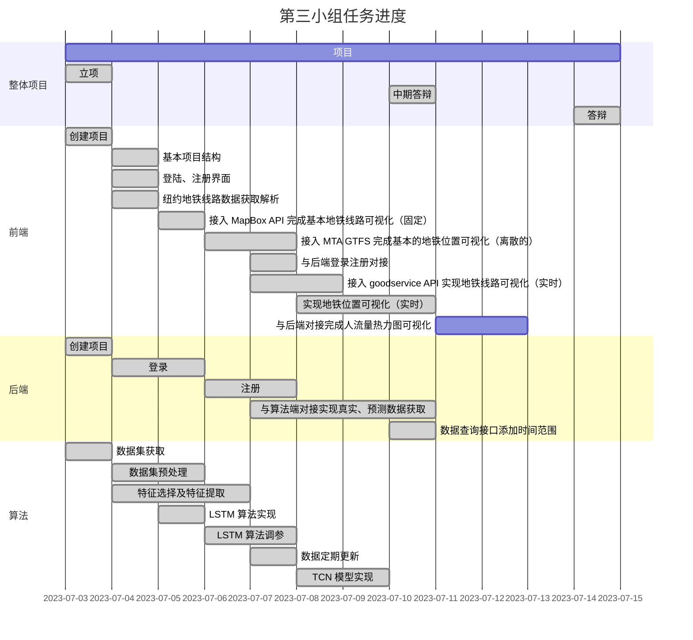

# 基于TCN模型与GTFS实时数据的地铁客流信息实时预测系统

这个题目本来叫做「基于时间序列模型的地铁客流量预测系统」，但是其实不太贴切。
功能：
- 纽约地铁实时位置显示
- 纽约地铁站点实时客流量热力图显示
- 纽约地铁站点实时客流量数据图表显示
- 纽约地铁站点未来客流量预测及数据图表显示

或许应该叫「纽约地铁实时客流信息显示系统」

实时数据来源使用了 GTFS 技术，而客流预测使用了 TCN 模型

那么或许可以叫「基于TCN模型与GTFS实时数据的地铁客流信息实时预测系统」

